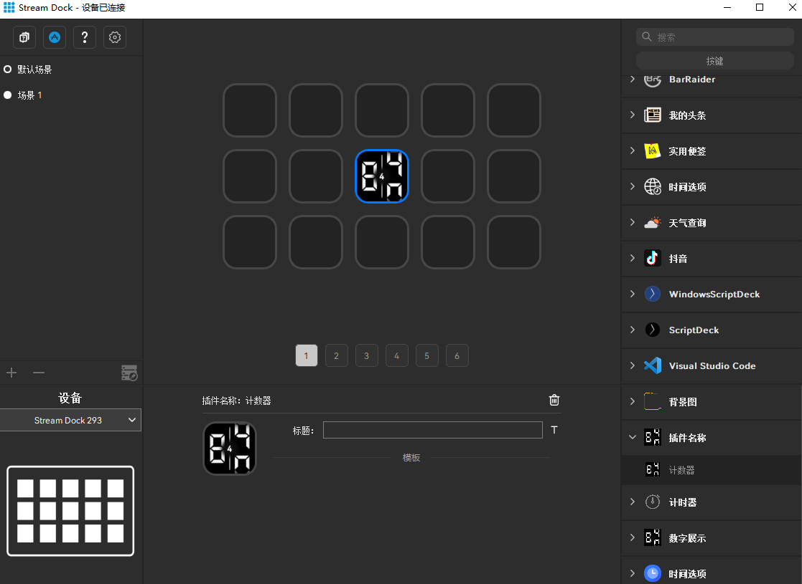

`Counter` is a sample plugin demonstrating the [Mirabox Space SDK](https://sdk.key123.vip/en).

# Description

The counter plugin is used to display the number of times a button is pressed. Pressing the button will increase the counter.

# Features

* Written in JavaScript

* Cross-platform (macOS, Windows)

* Persistent settings (number of button presses)

<figure style="text-align: center;">
  
  <figcaption>Counter Example</figcaption>
</figure>
