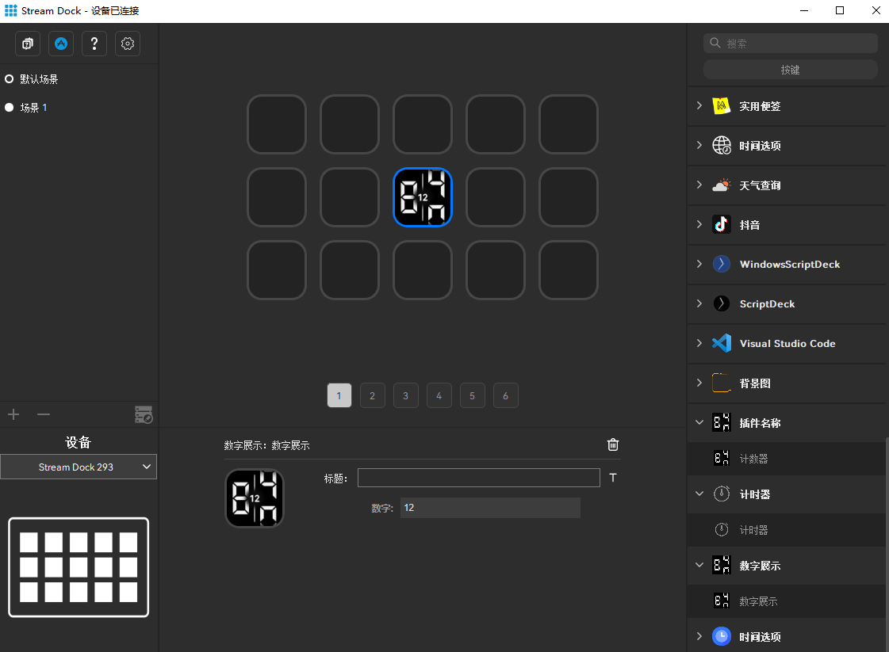

`Number Display` is a sample plugin demonstrating the [Mirabox Space SDK](https://sdk.key123.vip).

# Description

The number display plugin is used to show the selected number.

# Features

* Written in C++

* Cross-platform (macOS, Windows)

* Persistent settings (entered number)

<figure style="text-align: center;">
  
  <figcaption>Number Display Example</figcaption>
</figure>
