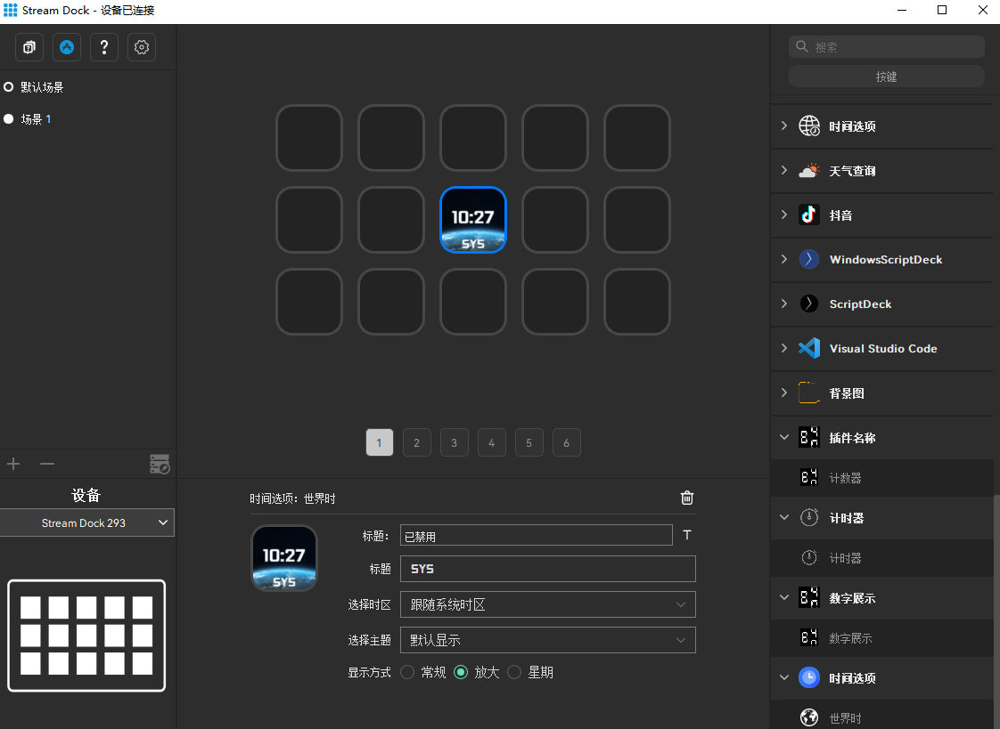

`Time` is a sample plugin demonstrating the [Mirabox Space SDK](https://sdk.key123.vip).

## Description

The time plugin displays the time on a button and switches seconds when the button is pressed.

## Features

* Written in Vue

* Cross-platform (macOS, Windows)

<figure style="text-align: center;">
  
  <figcaption>Time Example</figcaption>
</figure>
