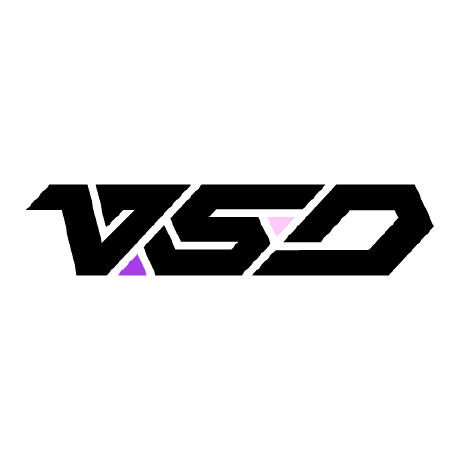

  
  <h1 align="center">VSDinside Plugins</h1>

  

## Getting Started

Visit [https://sdk.key123.vip/en/](https://sdk.key123.vip/en/) to start using our SDK. Here you'll find:

- Complete API Documentation
- Plugin Development Guide
- Example Code
- Best Practices

## Developer Community

We value feedback and suggestions from every developer. Join our vibrant community:

- [Discord Community](https://discord.vsdinside.com/) - Join other developers, share experiences and get help

## Feedback

VSDinside grows with support from our community. If you have any suggestions or encounter issues:

- Use GitHub Issues to report problems
- Connect with us directly on Discord

## Contributing

We welcome all forms of contributions, including:

- Submitting new plugins
- Improving existing features
- Reporting issues

## License

This project is licensed under the [GNU General Public License v3.0](LICENSE).